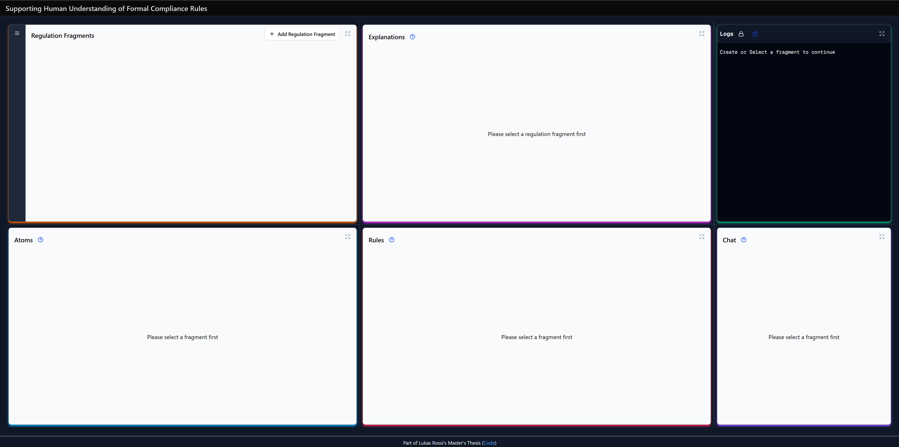
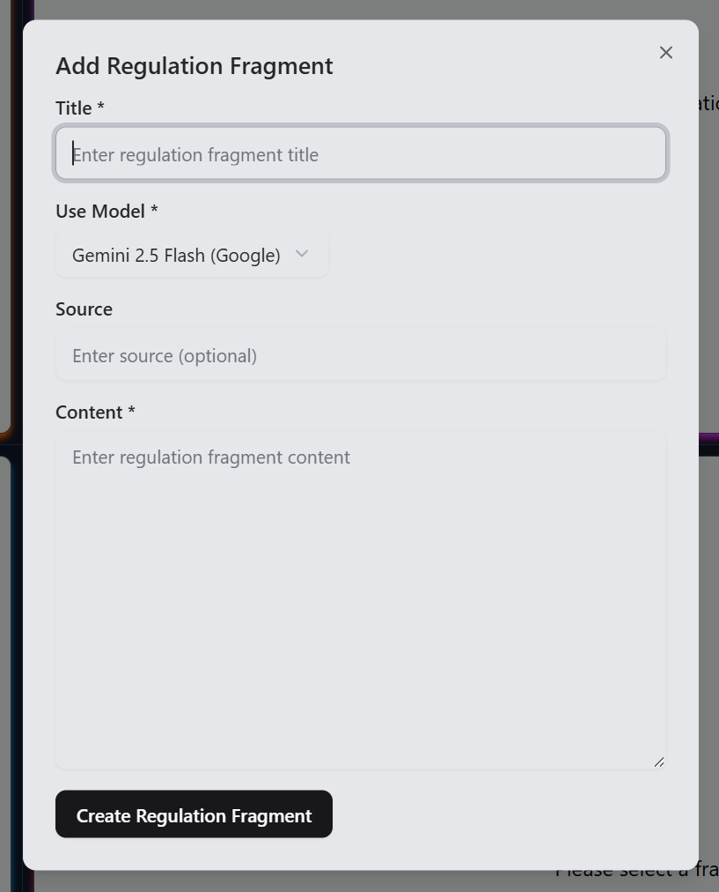
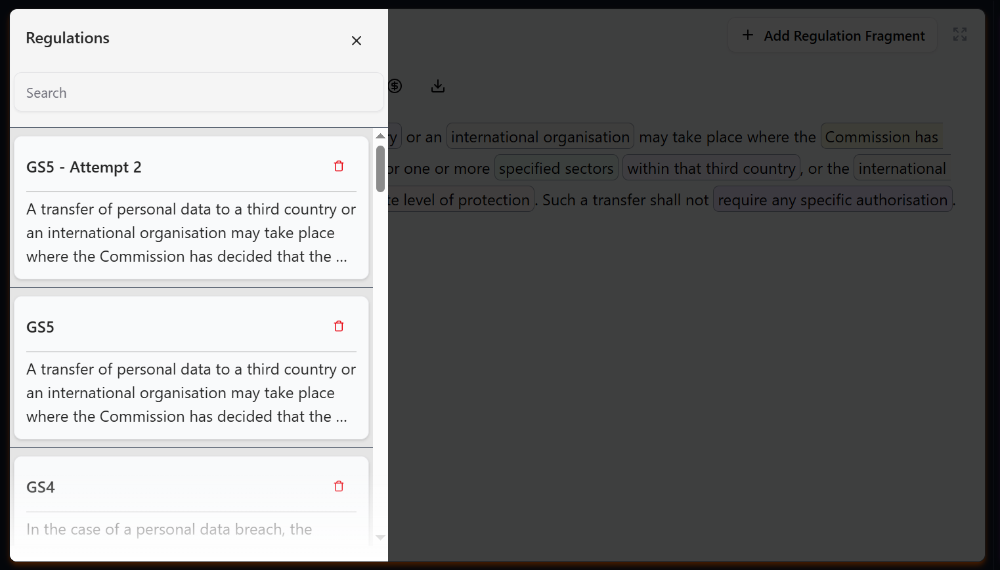
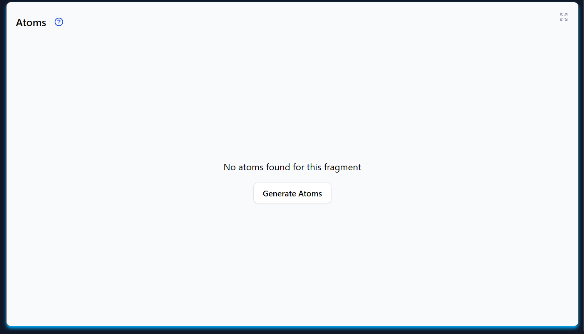
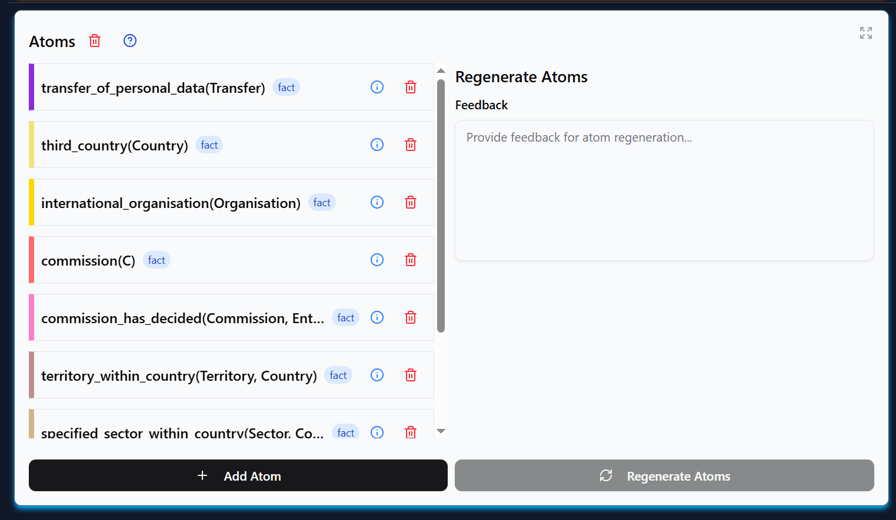
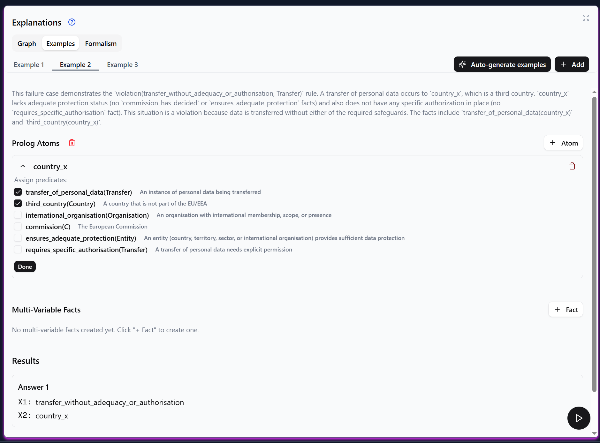
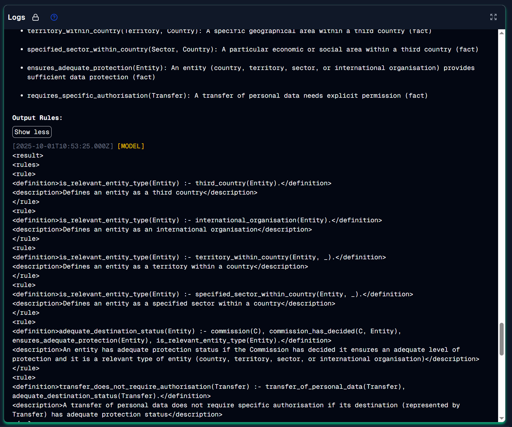
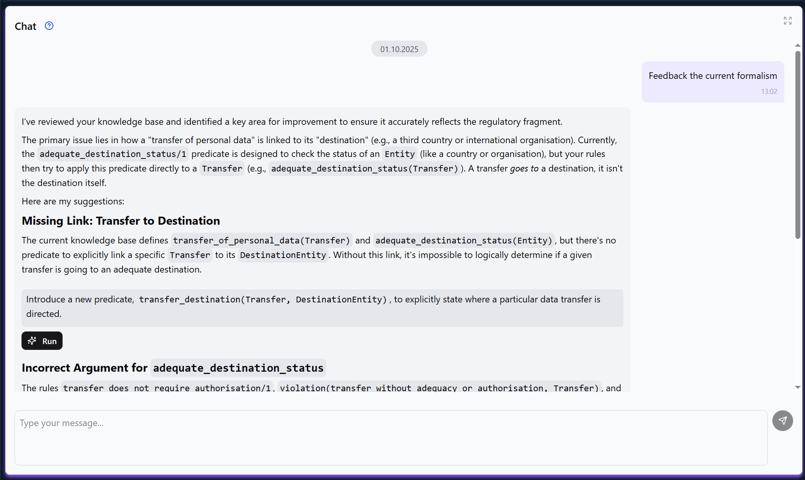

# MA Use Case

This repository contains the prototypical implementation of
the human-machine system described in Lukas Rossi's Master's thesis.

## How to Run

### Using Docker Compose

You can quickly run the entire application stack using Docker Compose:

1. Set the following environment variables on your system or create a `.env` file in `/deployment` with the following
   variables
   set:
    - `OPENAI_API_KEY` - [Get your API key from OpenAI](https://platform.openai.com/api-keys)
    - `ANTHROPIC_API_KEY` - [Get your API key from Anthropic](https://console.anthropic.com/settings/keys)
    - `GOOGLE_API_KEY` - [Get your API key from Google Cloud Console](https://console.cloud.google.com/apis/credentials)
    - `GOOGLE_PROJECT_ID` - [Find your Project ID in Google Cloud Console](https://console.cloud.google.com/welcome)

2. Run the following command from the project root:
   ```
   docker compose -f ./deployment/services.yml up
   ```

(You might want to add a project name with the `-p` for recognizing the containers later)

3. Access the application:
   A web server should now run at [http://localhost:3000](http://localhost:3000)
   (The backend will also be exposed at port 5000)

### For Development

- Run Node 22 And Python 3.13. Newer may work, but are not tested.
    - I can recommend [nvm](https://github.com/nvm-sh/nvm) for managing node versions
    - For python, [pyenv](https://github.com/pyenv/pyenv) should work though I have not tested it. After the venv is
      created (by running the venv module using the correct python version) everything should be set though.
- Spin up the Postgres and SWI-Prolog services.
- You will need to setup the backend first as the frontend depends on it for type generation.

#### Backend

Create a venv environment and install the dependencies (From within the `backend` directory):

Unix:

```bash
python3 -m venv .venv
source .venv/bin/activate
```

Windows:

```bash
python -m venv venv
venv\Scripts\Activate
```

_Important_:
The name of the virtual environment must be `.venv` for the type generation script to work correctly.

Install the dependencies:

```bash
pip install -r requirements.txt
```

Run the backend:

Windows:

```bash
python app.py
```

Unix:

```bash
python3 app.py
```

With a running database you can now make sure all migrations are applied:

```bash
alembic upgrade head
```

#### Frontend

From inside the `frontend` directory, run the following commands:

Install dependencies and generate types:

```bash
npm i
```

Run the Next.js development server:

```bash
npm run dev
```

## How to use

The application will run at [http://localhost:3000](http://localhost:3000).
You should be greeted by the following screen:



### Adding Regulation Fragments
Add new regulation fragments by clicking the "Add Regulation Fragment" button.

Make sure to select the LLM you want to use as it cannot be changed later.
You can switch between existing fragments using the burger menu in the top left corner.

Note, all panels can be resized by dragging their borders or clicking the full-screen button
in the top right corner.


### Generating Atoms
Begin the atom extraction by clicking the "Generate Atoms" button.


After the atoms are generated, you can inspect them in the "Atoms" panel.

Created traces can be inspected by hovering over each atom. The
corresponding text spans will be highlighted in the regulation fragment text area.
You can regenerate the atoms by providing feedback in the feedback text area.
You can also create individual atoms using the "Add Atom" button.

### Generating Rules
When you are satisfied with the created atoms, you can generate rules by clicking the
"Generate Rules" button.
You can again regenerate rules by providing feedback in the corresponding text area.

### The Explanations
Use the Graph tab to view the dependency graph of the created atoms and rules.
In the examples tab, you can generate examples and execute them to see how
the rules behave. Us ethe play button to execute the example.



### The Logs
The logs provide you with a detailed view of all interactions with the LLMs.


### The Chat
You can use the chat to ask questions about the currently loaded regulation fragment.
When prompted, the chat will provide you with improvements to the current knowledge base.
